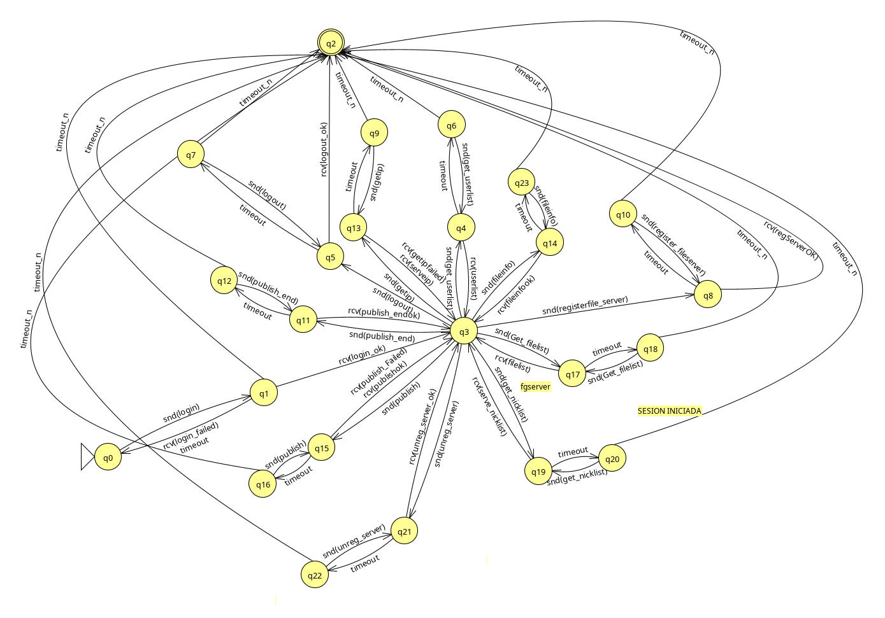
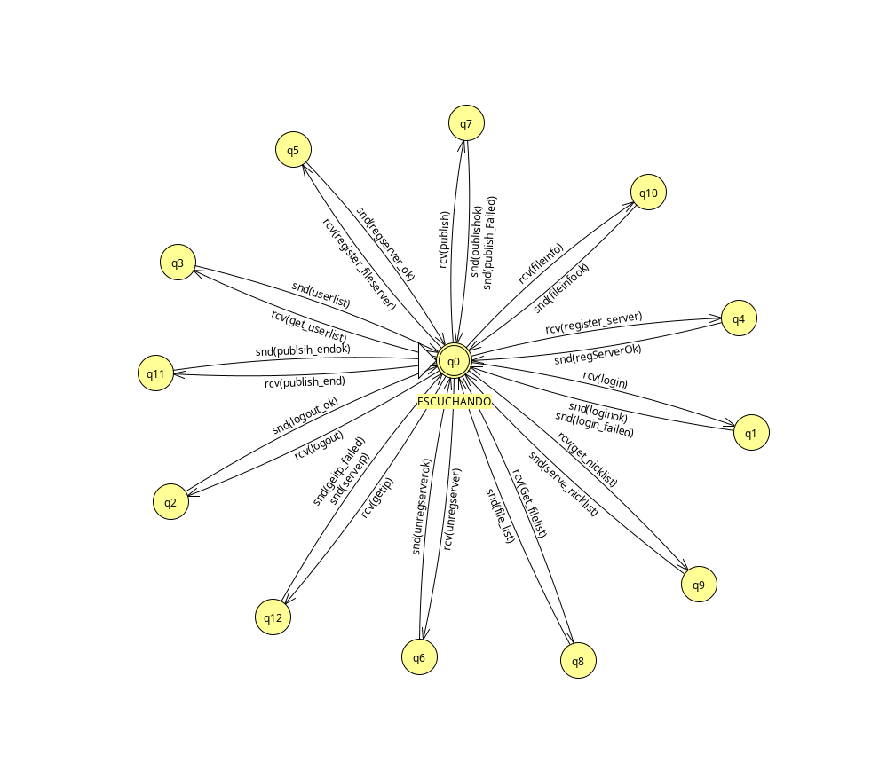
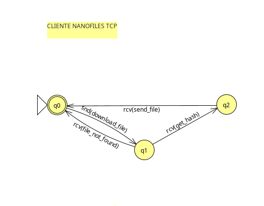
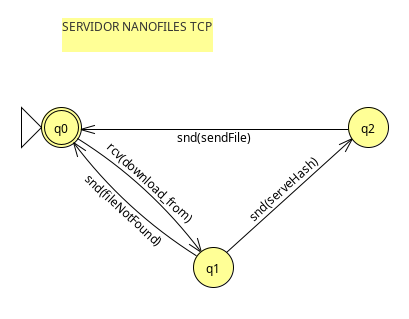
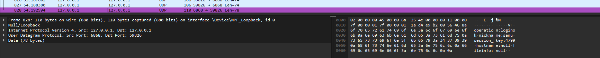
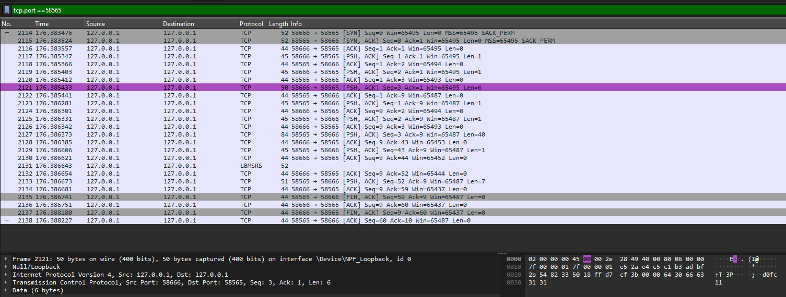
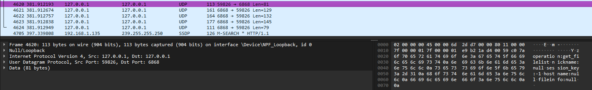

**DISEÑO DE LA PRÁCTICA DE REDES DE COMUNICACIONES**

**2023/2024**

**Samuel Avilés Conesa**

**Gloria Sánchez Alonso**

## 1.Introducción. 

En este documento se especifica el diseño del proyecto NanoFiles,
abarcando así la especificación de los protocolos de comunicación,
mostrando ejemplos de comunicación entre clientes y servidores y
comentando las mejoras implementadas respecto a la práctica base. Por un
lado, se especifican los mensajes y estados entre el cliente y el
Directorio que se envían mediante el protocolo UDP, por lo que para cada
mensaje debe haber una confirmación de recepción del receptor, siendo un
protocolo no confiable. Por otro lado, se especifican los mensajes y
estados entre los peers, cuando uno actúa como servidor de ficheros y
otro como cliente. Estos mensajes se envían mediante el protocolo TCP
asegurando así que los mensajes son recibidos con éxito por ambos al
tratarse de un protocolo de comunicación confiable y con conexión. Cabe
destacar que ambos tipos de mensajes se envían con diferentes formatos
comunicando así de la mejor manera posible según el tipo de operación
realizada.

## 2. Formato de los mensajes del protocolo de comunicación con el Directorio 

Para definir el protocolo de comunicación con el *Directorio*, vamos a
utilizar mensajes textuales con formato "campo:valor". El valor que tome
el campo "operation" (código de operación) indicará el tipo de mensaje y
por tanto su formato (qué campos vienen a continuación).

> **[Tipos y descripción de los mensajes]**

Mensaje: **login**

Sentido de la comunicación: Cliente→ Directorio

> Descripción: Este mensaje lo envía el cliente de NanoFiles al
> Directorio para solicitar "iniciar sesión" y registrar el nickname
> indicado en el mensaje.

Ejemplo:

operation: login\\n

nickname: alicia\\n

\\n

> Mensaje: **loginok**
>
> Sentido de la comunicación: Directorio→ Cliente
>
> Descripción: Este mensaje lo envía el Directorio al cliente de
> NanoFiles para confirmar el inicio de sesión exitoso.
>
> Ejemplo:

operation: loginok\\n

nickname: alicia\\n

session_key: 123\\n

\\n

> Mensaje: **login_failed**
>
> Sentido de la comunicación: Directorio→ Cliente
>
> Descripción: Este mensaje lo envía el Directorio al cliente de
> NanoFiles para rechazar el inicio de sesión debido a que el usuario
> que pretendía iniciar ya se encuentra activo.
>
> Ejemplo:

operation: login_failed\\n

\\n

> Mensaje: **logout**
>
> Sentido de la comunicación: Cliente→ Directorio
>
> Descripción: Este mensaje lo envía el cliente de NanoFiles al
> Directorio para solicitar "cerrar sesión" y eliminar el nickname
> indicado en el mensaje de la lista de usuarios activos.
>
> Ejemplo:

operation: logout\\n

session_key: 123\\n

\\n

> Mensaje: **logoutok**
>
> Sentido de la comunicación: Directorio→ Cliente
>
> Descripción: Este mensaje lo envía el Directorio al cliente de
> NanoFiles para confirmar el cierre de sesión exitoso.
>
> Ejemplo:

operation: logoutok\\n

\\n

> Mensaje: **getUserlist**
>
> Sentido de la comunicación: Cliente→ Directorio
>
> Descripción: Este mensaje lo envía el cliente de NanoFiles al
> Directorio para solicitar la lista de usuarios activos.
>
> Ejemplo:

operation: getUserlist\\n

\\n

> Mensaje: **userlist**
>
> Sentido de la comunicación: Directorio→ Cliente
>
> Descripción: Este mensaje lo envía el Directorio al cliente de
> NanoFiles para enviar la lista de usuarios al usuario que ha hecho
> userlist.
>
> Ejemplo:

operation: userlist\\n

nickname: pepe,juan,alicia,alberto\\n

\\n

> Mensaje: **publish**
>
> Sentido de la comunicación: Cliente → Directorio
>
> Descripción: Este mensaje lo envía el cliente al directorio de
> NanoFiles para solicitar enviar la lista de ficheros que tiene
> disponibles. Si no ha ejecutado el comando bgserver, no será posible
> enviar este mensaje.
>
> Ejemplo:

operation: publish\\n

Session_key: 123\\n

\\n

> Mensaje: **publish_ok**
>
> Sentido de la comunicación: Directorio→ Cliente
>
> Descripción: Este mensaje lo envía el directorio al cliente de
> NanoFiles para confirmar que puede comenzar a mandar información de
> ficheros
>
> Ejemplo:

operation: publish_ok\\n

\\n

> Mensaje: **fileinfo**
>
> Sentido de la comunicación: Cliente → Directorio
>
> Descripción: Este mensaje lo envía el cliente al directorio de
> NanoFiles para enviar la información sobre cierto fichero.
>
> Ejemplo:

operation: fileinfo\\n

Session_key: 123\\n

Files: hola.pdf,adios.pdf\\n

\\n

> Mensaje: **fileinfook**
>
> Sentido de la comunicación: Directorio→ Cliente
>
> Descripción: Este mensaje lo envía el directorio de NanoFiles al
> cliente para confirmar la recepción de un mensaje de tipo fileinfo.
>
> Ejemplo:

operation: fileinfook\\n

\\n

> Mensaje: **publish_end**
>
> Sentido de la comunicación: Cliente → Directorio
>
> Descripción: Este mensaje lo envía el cliente al directorio de
> NanoFiles para informar al directorio de que ha terminado de enviar
> información sobre ficheros.
>
> Ejemplo:

operation: publih_end\\n

\\n

> Mensaje: **publish_endok**
>
> Sentido de la comunicación: Directorio→ Cliente
>
> Descripción: Este mensaje lo envía el directorio al cliente de
> NanoFiles para confirmar que ha terminado de recibir información de
> ficheros y ha terminado el publish.
>
> Ejemplo:

operation: publish_endok\\n

\\n

> Mensaje: **publish_failed**
>
> Sentido de la comunicación: Directorio→ Cliente
>
> Descripción: Este mensaje lo envía el directorio al cliente de
> NanoFiles para denegar un intento de hacer publish.
>
> Ejemplo:

operation: publish_failed\\n

\\n

> Mensaje: **register_fileserver**
>
> Sentido de la comunicación: Cliente → Directorio
>
> Descripción: Este mensaje lo envía el cliente al directorio de
> NanoFiles para informar de que activa el servidor de ficheros.
>
> Ejemplo:

operation: reg_fileserver\\n

Session_key: 123\\n

\\n

> Mensaje: **register_serverok**
>
> Sentido de la comunicación: Directorio → Cliente
>
> Descripción: Este mensaje lo envía el cliente al directorio de
> NanoFiles para informar de que se ha recibido correctamente la
> petición de registro de un servidor de ficheros.
>
> Ejemplo:

operation: regserver_ok\\n

\\n

> Mensaje: **unregister_fileserver**
>
> Sentido de la comunicación: Cliente → Directorio
>
> Descripción: Este mensaje lo envía el cliente de NanoFiles al
> Directorio para informar de que va a detener su servicio como
> servidor.
>
> Ejemplo:

operation: unreg_fiileserver\\n

\\n

> Mensaje: **unregserver_ok**
>
> Sentido de la comunicación: Directorio → Cliente
>
> Descripción: Este mensaje lo envía el directorio de NanoFiles al
> cliente para informar de que se ha recibido correctamente el aviso
>
> Ejemplo:

operation: unregserver_ok\\n

\\n

> Mensaje: get_nicklist
>
> Sentido de la comunicación: Cliente → Directorio
>
> Descripción: Este mensaje lo envía el cliente de NanoFiles al
> Directorio para solicitar la lista de nicknames de los servidores que
> tienen disponible un determinado fichero identificado por su hash.
>
> Ejemplo:

operation: get_nicklist \\n

fileinfo: abc123\\n

\\n

Mensaje: serve_nicklist

Sentido de la comunicación: Directorio → Cliente

Descripción: Este mensaje lo envía el Directorio al cliente de NanoFiles
para enviar la lista de nicknames de los servidores que tienen
disponible el fichero identificado por el hash especificado en el
mensaje de búsqueda.

Ejemplo:

operation: serve_nicklist\\n

nickname: server1,server2,server3\\n

\\n

Mensaje: hash_not_found

Sentido de la comunicación: Directorio → Cliente

Descripción: Este mensaje lo envía el Directorio al cliente de NanoFiles
para informar que el hash enviado para identificar cierto fichero no es
correcto o es ambiguo.

Ejemplo:

operation: hash_not_found\\n

\\n

Mensaje: getip

Sentido de la comunicación: Cliente→ Directorio

Descripción: Este mensaje lo envía el cliente de NanoFiles al Directorio
para solicitar la direccion ip y puerto de un servidor de ficheros
activo identificado por su nombre.

Ejemplo:

operation: getip\\n

nickname: Alicia\\n

\\n

Mensaje: serveip

Sentido de la comunicación: Directorio→ Cliente

Descripción: Este mensaje lo envía el Directorio al cliente de NanoFiles
para responder a la solicitud de la direccion ip y puerto de un servidor
de ficheros activo identificado por su nombre.

Ejemplo:

operation: serveip\\n

hostname: 192.168.1.1:10000\\n

\\n

Mensaje: getip_failed

Sentido de la comunicación: Directorio→ Cliente

Descripción: Este mensaje lo envía el Directorio al cliente de NanoFiles
para responder a la peticion de obtención de la ip y puerto de un
servidor negativamente.

Ejemplo:

operation: getip_failed\\n

\\n

## 3. Formato de los mensajes del protocolo de transferencia de ficheros 

Para definir el protocolo de comunicación con un servidor de ficheros,
vamos a utilizar mensajes binarios multiformato. El valor que tome el
campo "opcode" (código de operación) indicará el tipo de mensaje y por
tanto cuál es su formato, es decir, qué campos vienen a continuación.

### 3.1 Formatos de mensajes 
**Para una correcta visualización del formato de mensajes, es preferible leer el codigo fuente del fichero readme.md**

**Formato: Control**

  -----------------------------------------------------------------------
  **Opcode**

  **1 byte**
  -----------------------------------------------------------------------

**Formato: Operación**

  ---------------------- ------------------------ -----------------------
  **Opcode**             **Parametro1**           **Parametro2**

  **1 byte**             **8 bytes**              **8 byte**
  ---------------------- ------------------------ -----------------------

**Formato: TLV (Tipo-Longitud-Valor)**

  ---------------------- ------------------------ -----------------------
  **Opcode**             **Longitud**             **Valor**

  **1 byte**             **1/2/4/8 bytes**        **n bytes**
  ---------------------- ------------------------ -----------------------

### 3.2 Tipos y descripción de los mensajes

Mensaje: **FileNotFound (opcode = 4)**

Sentido de la comunicación: Servidor de ficheros → Cliente

Descripción: Este mensaje lo envía el servidor de ficheros al cliente
ºpara indicar que no es posible encontrar el fichero con la información
proporcionada en el mensaje de petición de descarga.

Ejemplo:

+-----------------------------------------------------------------------+
| **Opcode**                                                            |
|                                                                       |
| **(1 byte)**                                                          |
+-----------------------------------------------------------------------+
| **4**                                                                 |
+-----------------------------------------------------------------------+

[Mensaje]: **downloadFile** (OPCODE = 1)

[Formato]: Operación

[Sentido de la comunicación]: Cliente→ Servidor de ficheros

[Descripción]:

Este mensaje lo envía el cliente de NanoFiles al Servidor de ficheros
para solicitar

la descarga de un fichero identificado con su hash, determinado según su
longitud (campo longitud) y su valor (campo valor). El valor asignado al
OPCODE es 1.

+----------------------+-----------------------+----------------------+
| **Opcode**           | **Longitud**          | **Valor**            |
|                      |                       |                      |
| **(1 byte)**         | **(1byte)**           | **(n bytes)**        |
+----------------------+-----------------------+----------------------+
| **1**                | **x**                 | **xxxxxx\...**       |
+----------------------+-----------------------+----------------------+

[Mensaje]: **sendFile** (OPCODE = 2)

[Formato]: TLV

[Sentido de la comunicación]: Servidor de ficheros → Cliente

[Descripción]:

Este mensaje lo envía el servidor de ficheros al cliente para devolverle
el fichero solicitado. El valor asignado al OPCODE es 2. La longitud es
el tamaño del fichero (número de tipo long) y el Valor es el contenido
del fichero. El tamaño de este último campo viene delimitado por el
campo longitud.

+----------------------+------------------------+----------------------+
| **Opcode**           | **Longitud**           | **Valor**            |
|                      |                        |                      |
| **(1 byte)**         | **(8bytes)**           | **(n bytes)**        |
+----------------------+------------------------+----------------------+
| **2**                | **xxxxxxxx**           | **xxxx\...**         |
+----------------------+------------------------+----------------------+

[Mensaje]: **serveHash**(OPCODE = 3)

[Formato]: TLV

[Sentido de la comunicación]: Servidor de ficheros → Cliente

[Descripción]:

Este mensaje lo envía el servidor de ficheros al cliente para entregar
el hash completo del fiichero solicitado para que el cliente pueda
comprobar su integridad una vez recibido. El valor asignado al OPCODE es
3. La longitud es el tamaño del hash y el valor es el hash del fichero.
El tamaño de este último campo viene delimitado por el campo longitud.

+----------------------+------------------------+----------------------+
| **Opcode**           | **Longitud**           | **Valor**            |
|                      |                        |                      |
| **(1 byte)**         | **(1byte)**            | **(n bytes)**        |
+----------------------+------------------------+----------------------+
| **3**                | **x**                  | **xxxx\...**         |
+----------------------+------------------------+----------------------+

## 4. Autómatas de protocolo 

Con respecto a los autómatas, hemos considerado las siguientes
restricciones:

-   Un cliente del directorio no puede hacer nada si no ha iniciado
    sesión previamente.

-   Un cliente del directorio no puede hacer nada más tras ejecutar el
    comando fgserver.

### 4.1 Autómata rol cliente de directorio 

### 4.2 Autómata rol servidor de directorio 

###  

###  

### 4.3 Autómata rol cliente de ficheros 

### 4.4 Autómata rol servidor de ficheros 

## 5. Mejoras implementadas 

**-Comando fgserver con puerto variable: 0.5**

Para realizar esta mejora se ha declarado un atributo *port* en la clase
NFServerSimple el cual va aumentando de uno en uno mientras va
intentando crear la conexión con el socket.

**-Comando dowloadfrom por nickname: 1**

Para realizar esta mejora se ha realizado un cambio en la ejecución de
servidores de ficheros, de manera que en el momento en que se arranca un
servidor de ficheros de cualquier tipo se registra en el directorio
enviandole así la ip y puerto en los que trabaja, de manera que el
directorio lo guarda y permite que cuando un cliente quiera descargar
cierto fichero utilizando el nickname pueda preguntarle al directorio
por la ip y puerto del servidor que tiene establecido el peer.

**-Comando bgserver secuencial y multihilo: 1.5**

Para poder realizar esta mejora simplemente se ha hecho que al ejecutar
el comando *bgserve* se cree un nuevo hilo en escucha de conexiones, de
manera que cuando se establece una nueva conexión se crea otro hilo el
cuál se encarga de gestionar la petición hecha por el cliente, dejando
así al hilo principal del servidor en escucha de nuevas peticiones
permitiendo múltiples conexiones simultáneas al servidor.

**-Comando stopserver: 0.5**

Para realizar esta mejora se ha creado una función que al ejecutar el
comando *stopserver* envía una señal al hilo principal del bgserver la
cual hace que se detenga la ejecución de dicho hilo y se cierre el
socket de conexión.

**-Comando bgserver con puerto efímero: 0.5**

Para realizar esta mejora simplemente se ha tenido que modificar el
constructor de la clase NFServer introduciendo un "0" en el constructor
del objeto ServerSocket lo que hace que para crear este socket elija un
puerto aleatorio de los libres.

**-Comando userlist con servidores: 0.5**

Para realizar esta mejora se ha hecho que cuando un servidor se da de
alta en el directorio como servidor se registra su clave de sesión junto
con su puerto de funcionamiento en una estructura de datos. Cuando se
solicita la lista de usuarios activos, si la clave de sesión de un
usuario está en esa estructura, se le marca como servidor.

**-Comandos publish+filelist+search: 1**

Para realizar dicha mejora se ha utilizado una estructura de datos en la
cual se guardan los ficheros publicados por cierto servidor junto a su
clave de sesión de manera que estos se identifiquen como que han sido
publicados por cierto usuario.

**-Comando filelist con servidores: 0.5**

Para implementar el filelist mostrando a su vez los servidores que han
publicado los ficheros simplemente se ha utilizado la estructura de
datos que asocia cierta clave de sesión con ficheros de manera que
cuando se pide la lista de ficheros solamente hay que añadir otro campo
con el nombre del usuario que lo ha publicado, este nombre se consigue
usando otra estructura que hay definida la cual asocia una clave de
sesión con un nombre de usuario.

**-Baja ficheros y servidores: 0.5**

Para mantener actualizada la lista de ficheros publicados y servidores
activos se ha hecho que cada vez que un servidor se da de baja se deba
comunicar con el directorio para avisarle y que este elimine sus
ficheros de las diferentes estructuras de datos. Además, cuando un
usuario cierra sesión, si este tiene un servidor activo también lo da de
baja para que se pueda realizar el mismo proceso.

## 6. Ejemplo de intercambio de mensajes  

Ejemplo de login

Ejemplo de downloadFrom (filtrando por el puerto de escucha del servidor
TCP)

Ejemplo de filelist

## 

## 7. Conclusiones

Este proyecto ha supuesto para nosotros un acercamiento al trabajo en el
mundo real, enfrentandonos a un proyecto de mayor envergadura a lo que
estamos acostumbrados. Aunque ha resultado bastante costoso de tiempo de
realizar, hemos aprendido gran cantidad de cosas nuevas y mejorado
nuestra habilidad de programación y nuestro uso de la lógica. Este
proyecto se corresponde totalmente con la teoría de la asignatura lo que
ayuda a entenderla y supone una mayor facilidad para la realización del
proyecto. En general, no ha resultado para nada pesada su implementación
y se ha ido llevando bastante bien durante las semanas, dedicando un día
a la semana antes de la sesión de prácticas, usando el consejo del
profesor, se ha comprendido todo y se ha realizado la implementación sin
exagerado quebradero de cabeza.
